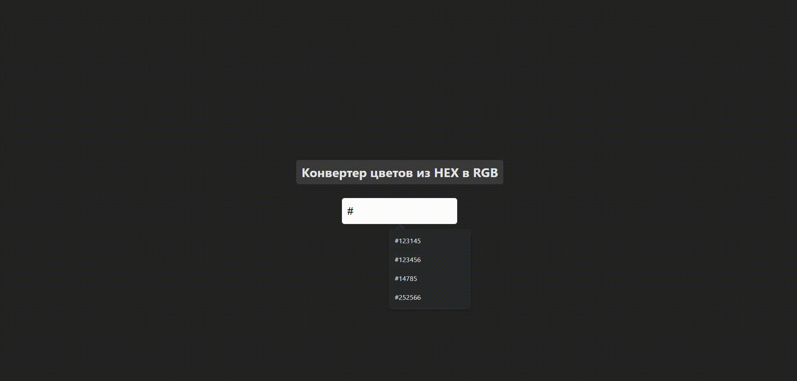

# color-converter
### Ссылка на прототип:

https://vobiryukov12.github.io/color-converter/

## Preview

## Описание
Мини-приложение на React, которое преобразует цвет из формата HEX в RGB.

### Возможности приложения:
- При правильном вводе цвета показывается его представление в формате RGB и меняется цвет фона на заданный
- При вводе неправильного цвета (для проверки на валидность используются регулярное выражение) в формате HEX всплывает сообщение об ошибке и фон становить красным
- Преобразование происходит только после ввода всех семи символов, включая решётку

### Технологии используемые на проекте:

